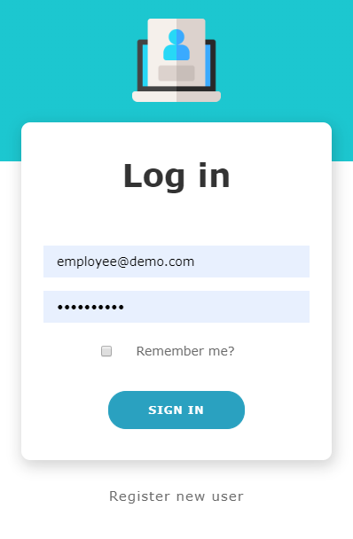
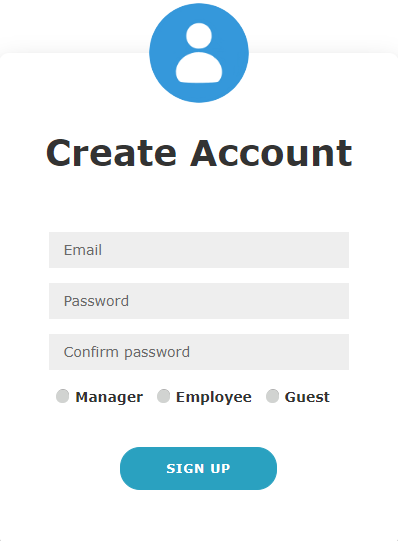
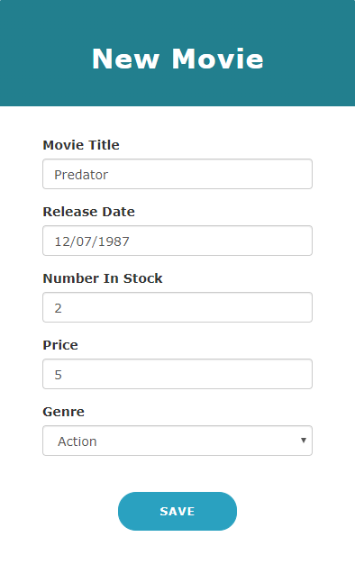
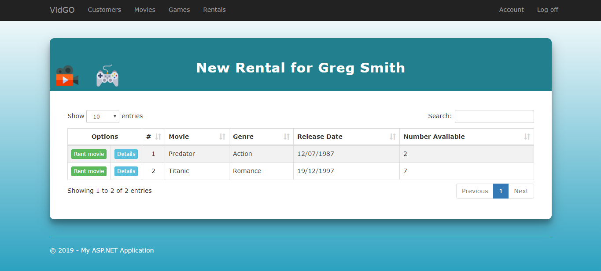

# VidGO - rental management app
Simple video rental management application designed for usage of rental store staff members created with ASP<span></span>.NET MVC.

## Table of contents
* [General info](#general-info)
* [Technologies](#technologies)
* [Setup](#setup)
* [Features](#features)
* [User types and roles](#user-types-and-roles)
* [Inspiration](#inspiration)
* [Screenshots](#screenshots)

## General info
This application is dedicated only for physical retail business management purposes. Based on user account type you get priviliges to get accesss to different parts of application to perform actions. It is designed for video rental shop employees, so customer's actions in application are not taken.

## Technologies
Project is created with:
* ASP<span></span>.NET MVC V5.2.4.0
* EntityFramework V6.2.0
* Javascript
* jQuery V3.3.1
* jQuery.UI V1.12.1.1
* DataTables V1.10.15
* Bootstrap V3.4.1
* HTML
* CSS
* Bootbox.js V4.3.0
* FluentValidation V8.1.1

## Setup
To run this project, you may need to customize Data Source of connectionString property in Web.config, cause by default database runs on LocalDB.  

To create database go to Package Manager Console and type

```
update-database
```

This command will execute instructions in Up method of all existing migrations.

## Features
* Manage list of customers and products
* Make new rentals
* Return products
* Register new users by existing ones
* Restrict operations by user roles
* Prevent from displaying product's negative number available when product is rented and employee decrease number in stock
* Availability to top up customer's balance when it is not sufficient to rent product
* Check for membership expiry while making new rental
* Validate correctness  of input fiels in forms

## User types and roles
In application are three types of user:
* Manager
* Employee
* Guest

Each user type has different privileges, let's group them by:  

**Customer and product lists modification**

<table>
    <tr>
        <th rowspan="2">Account user type</th>
        <th colspan="3">Permitions</th>
    </tr>
    <tr>
        <th>Read</th>
        <th>Write</th>
        <th>Delete</th>
    </tr>
    <tr align="center">
        <td>Manager</td>
        <td>X</td>
        <td>X</td>
        <td>X</td>
    </tr>
    <tr align="center">
        <td>Employee</td>
        <td>X</td>
        <td>X</td>
        <td></td>
    </tr>
    <tr align="center">
        <td>Guest</td>
        <td>X</td>
        <td></td>
        <td></td>
    </tr>
</table>

___

**Making rentals and returning products**

<table>
    <tr>
        <th>Account user type</th>
        <th>Make</th>
         <th>Return</th>
    </tr>
    <tr align="center">
        <td>Manager</td>
        <td>X</td>
        <td>X</td>
    </tr>
    <tr align="center">
        <td>Employee</td>
        <td>X</td>
        <td>X</td>
    </tr>
    <tr align="center">
        <td>Guest</td>
        <td></td>
        <td></td>
    </tr>
</table>

___

**Creating new users**

<table>
    <tr>
        <th rowspan="2">Account user type</th>
        <th colspan="3">Can be created</th>
    </tr>
    <tr>
        <th>Manager</th>
        <th>Employee</th>
        <th>Guest</th>
    </tr>
    <tr align="center">
        <td>Manager</td>
        <td>X</td>
        <td>X</td>
        <td>X</td>
    </tr>
    <tr align="center">
        <td>Employee</td>
        <td></td>
        <td>X</td>
        <td>X</td>
    </tr>
    <tr align="center">
        <td>Guest</td>
        <td></td>
        <td></td>
        <td>X</td>
    </tr>
     <tr align="center">
        <td>Anonymous (not logged)</td>
        <td></td>
        <td></td>
        <td>X</td>
    </tr>
</table>

## Inspiration
This app is created based on Mosh Hamedani's [The Complete ASP.NET MVC 5 Course](https://codewithmosh.com/p/asp-net-mvc), Mosh's final solution can be found on [github](https://github.com/mosh-hamedani/vidly-mvc-5). I was working along to certain point and then split into my own implementations.

### Introduced/improved features

* Create UI with HTML and CSS
* Use FluentValidation library for domain model vailidation
* Add game as second type of product
* Create view for rent products
* Hide not available products from rent products view
* Calculate number available of product after number in stock edition
* Create views for rented products
* Add ability to return products
* Add customer's balance property and check if balance is sufficient to make new rental
* If balance is not sufficient it is capable to top up customer's balance using AJAX
* Add product rent price calculation considering customer's discount rate
* Add membership's assign and expiry date in new Memberships table
* Add check for membership expiry while making new rental
* Prevent from displaying product's negative number available when product is rented and employee decrease number in stock
* Introduce 2 types of user roles and restrict user operations based on them
* Add calendar for date type input fiels in forms
* Populate balance field in customer form based on selected membership

## Screenshots
<kbd></kbd> <br/><br/> 
<kbd></kbd> <br/><br/>
<kbd></kbd> <br/><br/>
<kbd></kbd> <br/><br/>